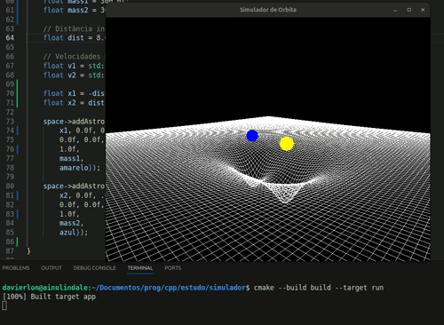

# Simulador de Órbita com GLFW + OpenGL

---

# Demonstração

Ajustando os astros declarados em `populateSpace()`e o tamanho da grade em `space.hpp`, podemos fazer qualquer sistema orbital

  

---

## Sobre o GLFW

O **GLFW** (Graphics Library Framework) é uma biblioteca leve escrita em C para criação de janelas, contextos OpenGL e gerenciamento de entrada (teclado, mouse, scroll, etc).  

Ele é responsável por:

- Criar a janela da aplicação
- Criar e gerenciar o contexto OpenGL
- Capturar eventos de teclado e mouse
- Controlar o loop de renderização

Neste projeto, o GLFW é usado para:
- Criar a janela principal
- Capturar teclas para movimentação da câmera
- Capturar scroll do mouse para zoom
- Controlar o tempo (`glfwGetTime`)
- Gerenciar o loop principal da aplicação

---

# 📌 Descrição do Projeto

Este projeto implementa um **simulador de órbita gravitacional 3D** utilizando:

- OpenGL (pipeline fixo)
- GLU (para renderizar esferas)
- GLFW (janela e entrada)
- C++

O sistema simula dois corpos massivos interagindo gravitacionalmente e renderiza:

- As esferas representando os astros
- Uma grade deformável que representa o "campo gravitacional"

---

# 📁 Estrutura do Projeto

- `/src`
    1. `main.cpp`
    2. `camera.cpp`
    3. `astro.cpp`
    4. `space.cpp`
    5. `colors.cpp`

- `/include`
    1. `main.hpp`
    2. `camera.hpp`
    3. `astro.hpp`
    4. `space.hpp`
    5. `colors.hpp`

---

# 📂 Arquivos da pasta `src`

---

## 🔹 `main.cpp`

Arquivo principal da aplicação.

### Responsabilidades:

- Inicializar o GLFW
- Criar a janela
- Criar a câmera
- Inicializar recursos gráficos dos astros
- Criar e popular o espaço com corpos celestes
- Executar o loop principal
- Calcular `deltaTime`
- Encerrar corretamente a aplicação

### Funções importantes:

#### `int main()`

- Cria a janela
- Instancia a câmera
- Registra callback de scroll
- Inicializa os recursos dos astros
- Popula o espaço
- Executa o loop principal:
  - Processa eventos
  - Atualiza física
  - Renderiza cena
  - Troca buffers

---

#### `populateSpace(Space* space)`

Cria dois astros massivos:

- Define massas
- Calcula velocidades para órbita aproximadamente circular
- Posiciona os corpos no centro de massa
- Adiciona os astros ao espaço

---

#### `StartGLFW()`

- Inicializa o GLFW
- Cria a janela
- Ativa o contexto OpenGL
- Habilita `GL_DEPTH_TEST`
- Define cor de fundo preta

---

#### `resize(GLFWwindow* window)`

- Ajusta o `glViewport`
- Configura projeção com `gluPerspective`
- Reseta a matriz ModelView

---

#### `scrollCallback(...)`

- Recupera ponteiro da câmera via `glfwSetWindowUserPointer`
- Aplica zoom com base no scroll do mouse

---

#### `getDeltaTime()`

- Calcula tempo entre frames
- Usa `glfwGetTime()`
- Permite simulação independente do FPS

---

## 🔹 `camera.cpp`

Implementa a câmera orbital 3D.

### Responsabilidades:

- Controlar posição da câmera em coordenadas esféricas
- Aplicar `gluLookAt`
- Processar entrada de teclado
- Aplicar zoom com scroll

---

### Métodos:

#### `Camera::applyView()`

- Converte coordenadas esféricas (theta, phi, radius) para cartesianas
- Aplica `gluLookAt`
- Permite rotação completa vertical (com up dinâmico)

---

#### `Camera::processInput(GLFWwindow*)`

Controles:

- ← → : Rotaciona horizontalmente
- ↑ ↓ : Rotaciona verticalmente
- ESC : Fecha a janela

---

#### `Camera::zoom(float offset)`

- Ajusta o raio da câmera
- Aplica limites mínimo e máximo

---

## 🔹 `astro.cpp`

Representa um corpo celeste da simulação.

### Responsabilidades:

- Armazenar posição, velocidade e aceleração
- Aplicar força gravitacional
- Atualizar movimento (integração)
- Desenhar esfera 3D

---

### Estrutura interna:

Cada astro possui:

- `pos[3]`
- `vel[3]`
- `acc[3]`
- `radius`
- `mass`
- `color[3]`

---

### Métodos:

#### `Astro::init()`

- Cria um `GLUquadric`
- Define normais suaves

---

#### `Astro::applyGravity(const Astro& other, float G)`

- Calcula força gravitacional
- Aplica aceleração baseada na lei da gravitação universal
- Evita divisão por zero

---

#### `Astro::update(float dt)`

- Atualiza velocidade
- Atualiza posição
- Reseta aceleração

---

#### `Astro::draw()`

- Aplica transformação de posição
- Define cor
- Renderiza esfera com `gluSphere`

---

## 🔹 `space.cpp`

Gerencia todos os astros e o campo gravitacional visual.

### Responsabilidades:

- Armazenar vetor de astros
- Calcular interação gravitacional entre todos
- Atualizar sistema
- Renderizar astros
- Renderizar grade deformada

---

### Métodos:

#### `addAstro(const Astro&)`

Adiciona um astro ao vetor.

---

#### `update(float dt)`

- Para cada par de astros:
  - Aplica gravidade
- Atualiza todos os astros

Complexidade: **O(n²)**

---

#### `draw()`

- Desenha todos os astros
- Desenha grade deformável

---

#### `drawGrid(float size, int divisions)`

Renderiza uma grade no plano XZ:

- Cada ponto da grade sofre deformação vertical
- A deformação depende:
  - Da massa dos astros
  - Da distância até o ponto
- Usa softening para suavizar singularidades

Isso cria um efeito visual semelhante a uma "curvatura do espaço".

---

## 🔹 `colors.cpp`

Contém os valores de cores comuns.

### Responsabilidades:

- Armazenar os valores RGB das variáveis que representam cores declaradas com `extern` em `colors.hpp`.

---

# 📂 Pasta `include`

Contém os headers (`.hpp`) correspondentes:

- `main.hpp` → Declarações globais e funções auxiliares
- `camera.hpp` → Definição da classe Camera
- `astro.hpp` → Definição da classe Astro
- `space.hpp` → Definição da classe Space
- `colors.hpp` → Definições de cores (vetores RGB)

---

# 🎮 Controles

| Tecla | Ação |
|-------|------|
| ←     | Rotaciona esquerda |
| →     | Rotaciona direita |
| ↑     | Rotaciona para cima |
| ↓     | Rotaciona para baixo |
| Scroll | Zoom |
| ESC   | Fecha aplicação |

---

# ⚙️ Conceitos Envolvidos

- Lei da Gravitação Universal
- Integração Numérica (Euler explícito)
- Coordenadas Esféricas
- Transformações em OpenGL
- Pipeline fixo
- Renderização 3D
- Simulação em tempo real

---

# 🚀 Possíveis Melhorias

- Adicionar colisões
- Shader moderno (OpenGL Core Profile)
- Interface para alterar massas em tempo real

---

# 🧠 Observação Final

O projeto demonstra:

- Organização modular
- Separação clara de responsabilidades
- Simulação física básica
- Uso correto de delta time
- Integração entre GLFW + OpenGL + GLU

É um excelente exercício de:

- Programação gráfica
- Estruturação de projeto em C++
- Simulação física básica